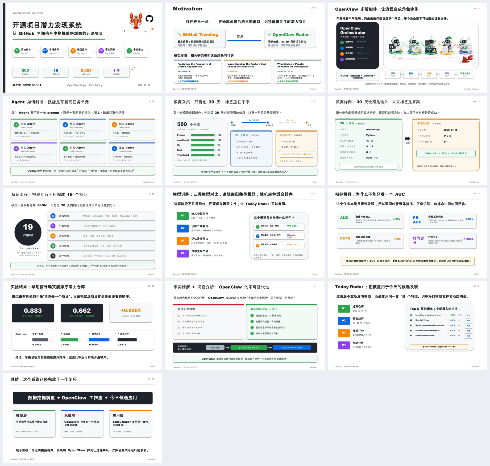
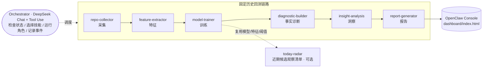
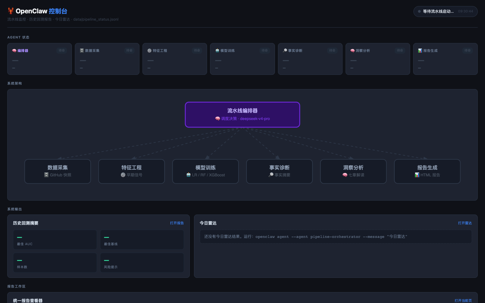

# OpenClaw · 开源项目潜力发现系统

> 用 GitHub 仓库**创建后 30 天内**的早期信号，做历史回测，预测一个仓库**约一年后**的 star 是否进入样本前 20%；并用一套 **OpenClaw 多智能体工作流**把"采集 → 特征 → 训练 → 事实诊断 → 洞察 → 报告"组织成可复现、可审计的流水线。

**课程级数据挖掘 + multi-agent 实验项目** ｜ 数据快照日期 2026-05-30 ｜ 语言：Python ｜ 状态：核心闭环已完成，可演示

---

## 0. 项目速览（TL;DR）

- **要解决的问题**：GitHub Trending 只能看到"已经火了"的项目；我们想更早一步——在仓库刚创建的早期窗口，用行为信号筛出"值得继续观察"的潜力项目。
- **怎么做**：把每个仓库拆成「创建后 30 天快照（模型输入）」和「约一年后的热度标签（训练答案）」，两边严格分开避免信息泄漏，然后训练排序模型。
- **核心结果**：早期信号确实能排序潜力仓库——最佳 **AUC 0.883（逻辑回归）**、**PR-AUC 0.662（随机森林）**，明显高于任何单特征排序规则（≤0.663）。
- **OpenClaw 的价值**：不是替代模型，而是把多步骤任务组织成"先算事实、再让大模型基于证据解释"的可复现工作流，每一步都留下中间产物和事件记录。
- **现在能跑什么**：完整离线 pipeline + OpenClaw Console（dashboard）+ 一套 9–10 分钟的展示 PPT/讲稿。

> 📊 13 页展示 PPT 预览（完整文件见 [`reports/OPEN_THIS_latest_presentation.pptx`](reports/OPEN_THIS_latest_presentation.pptx)）：
>
> 

---

## 目录

1. [项目背景与目标](#1-项目背景与目标)
2. [系统架构：OpenClaw 多智能体](#2-系统架构openclaw-多智能体)
3. [数据：30 天快照 + 未来标签](#3-数据30-天快照--未来标签)
4. [特征工程：19 个早期特征](#4-特征工程19-个早期特征)
5. [模型与评估](#5-模型与评估)
6. [关键发现与洞察](#6-关键发现与洞察)
7. [仓库结构](#7-仓库结构)
8. [如何复现 / 运行](#8-如何复现--运行)
9. [展示材料](#9-展示材料)
10. [当前进度与下一步](#10-当前进度与下一步)
11. [定位与边界（重要）](#11-定位与边界重要)

---

## 1. 项目背景与目标

**目标**：用仓库创建后 30 天内能观测到的早期信号，做**历史回测**，预测该仓库**至少一年后**的 star 是否进入样本内 top 20%，并自动生成可解释的实验分析报告。

**为什么可行（研究支撑）**：
- *Predicting the Popularity of GitHub Repositories* (PROMISE'16) —— 仓库流行度是可建模的量。
- *Understanding the Factors that Impact the Popularity* (ICSME'16) —— 语言、领域等项目特征带预测信号。
- *What Makes a Popular Academic AI Repository?* (EMSE/ICSE'21) —— 早期工程实践在热门 vs 冷门间显著差异。

**时间线约束（防泄漏的前提）**：当前数据基准日 `2026-05-30`。预测成立要求
`created_at + 30d(观察窗) + 365d(标签窗) ≤ 2026-05-30`，因此采集窗口为
`created_at ∈ [2025-03-01, 2025-04-30]`。

---

## 2. 系统架构：OpenClaw 多智能体

一个**总指挥（Orchestrator）** 负责调度，下面是若干**专职 Agent**，每个 Agent 都不是一句 prompt，而是一套明确的「输入 → 脚本 → 输出 → 事件记录」。



| Agent | 技能目录 | 输入 → 输出 | 产物 |
|---|---|---|---|
| 采集 | `skills/repo-collector` | GitHub API → 原始记录 | `data/repos_raw_500_strict.jsonl` |
| 特征 | `skills/feature-extractor` | 原始记录 → 19 个特征 | `data/features.csv` |
| 训练 | `skills/model-trainer` | 特征表 → 模型指标 | `data/model_results.json`、`data/model_artifacts/` |
| 事实 | `skills/diagnostic-builder` | 模型指标 → 结构化事实 | `data/diagnostic_summary.json` |
| 洞察 | `skills/insight-analysis` | 事实摘要 → 受约束解释 | `reports/INSIGHTS.md`、`reports/insights.html` |
| 报告 | `skills/report-generator` | 中间产物 → 可读报告 | `reports/*_final.html` |
| 应用 | `skills/today-radar` | 近期仓库 → 候选打分（可选） | `reports/today_radar.{json,html}` |

**OpenClaw 的不可替代性**：单次问大模型也能写分析，但容易引用不存在的数字、每次结果不一致、难以接入完整流程。OpenClaw 的做法是 **先由事实诊断模块算出结构化事实，再让大模型只能基于这些事实做解释，且引用数字必须能在事实摘要里校验** —— 把大模型从"编故事"变成"基于证据推理"。

> Console 实时展示 6 个步骤状态（事件源 `data/pipeline_status.jsonl`）：
>
> 

---

## 3. 数据：30 天快照 + 未来标签

每个仓库拆成两部分，**严格分开**：

- **30 天快照（模型输入）**：创建后 30 天内能看到的信息——历史 README、提交 / 问题 / 合并请求、前 30 天贡献者、语言 / 所属账号类型。
- **未来标签（训练答案）**：约一年后的 star 数，是否进入样本前 20%。star 只用来生成答案，**绝不进入模型输入**。

**数据集（`data/repos_raw_500_strict.jsonl`，batch=`strict_30d_1y_2025_03_04`）**

| 项 | 值 |
|---|---|
| 样本量 | 500 |
| 正例（进入前 20%） | 102（20.4%） |
| 负例 | 398 |
| 前 20% 阈值 | **49 stars** |
| 创建窗口 | 2025-03-01 .. 2025-04-30 |
| 观察窗 | 创建后 30 天 |
| 语言分布 | Python 100 · JavaScript 100 · Go 99 · Rust 99 · TypeScript 99 · 其他 3 |

**防泄漏要点**（`feature_provenance.all_strict_30d = true`）：
- commits / issues / PRs 都用 `since`+`until` 过滤到前 30 天；
- `contributors_30d` 基于前 30 天 commits 的不同 author 去重，**不**用当前 `/contributors`；
- 历史 README 通过 `/commits?until=cutoff` 找到第 30 天前最近一次 commit SHA，再 `/readme?ref=SHA` 拉取当时的 README；
- `current_stars / current_forks` 只放在 `labels`，不混入 snapshot。

---

## 4. 特征工程：19 个早期特征

模型不直接吃原始 JSON，而是把 30 天内的行为整理成**五类可比较信号**（`6 + 1 + 4 + 4 + 4 = 19`）：

| 类别 | 数量 | 特征 |
|---|---|---|
| 语言 one-hot | 6 | `lang_Python` · `lang_JavaScript` · `lang_Go` · `lang_Rust` · `lang_TypeScript` · `lang_Other` |
| 归属 | 1 | `is_org` |
| 早期活跃度 | 4 | `commits_30d` · `issues_30d` · `prs_30d` · `contributors_30d` |
| 历史 README | 4 | `has_readme_30d` · `readme_len_30d` · `readme_has_image_30d` · `readme_has_demo_url_30d` |
| 派生比率 | 4 | `activity_total_30d` · `commits_per_contributor_30d` · `prs_per_issue_30d` · `has_pr_activity_30d` |

> **已从模型移除**（相比早期 v2，为降低后验泄漏）：TF-IDF(topics+description)、`author_followers`、`author_public_repos`、`has_license`、以及无时间过滤的当前态 README / contributors。它们仍可能作为 audit metadata 留在 JSONL 中，但不进模型。

---

## 5. 模型与评估

训练三类模型，5 折交叉验证；不只跑分，还会保存模型文件 / 特征顺序 / 动态阈值供 today-radar 复用。

### 5.1 三类模型对比

| 模型 | AUC | PR-AUC | P@10 | 在本项目里的角色 |
|---|---|---|---|---|
| **逻辑回归 (LR)** | **0.883** | 0.624 | 0.80 | 整体排序最好、线性稳定、易解释 |
| **随机森林 (RF)** | 0.881 | **0.662** | 0.70 | 少数正例识别最好、适合候选排序（today-radar 用它） |
| **XGBoost** | 0.876 | 0.634 | 0.80 | 强基线对照 |

> 为什么不能只看一个 AUC：这是**候选发现**任务（正例只有 ~20%），所以同时看
> **AUC**（整体排序）、**PR-AUC**（少数正例识别）、**P@10**（前排候选质量）、**时间切分**（时间泛化）。

### 5.2 消融实验（逐步加特征，AUC）

| 特征组合 | 特征数 | AUC |
|---|---|---|
| 语言 + 归属 | 7 | 0.8562 |
| + 早期活跃度 | 11 | 0.8698 |
| + 历史 README | 15 | **0.8885** |
| + 派生比率（全 19） | 19 | 0.8812 |

→ 早期 README 能继续提升排序；继续加派生比率反而带来少量噪声（并非特征越多越好）。

### 5.3 时间切分（时间泛化）

按创建时间切分训练/测试（split=2025-04-18，RF）：time-split AUC `0.8816` vs 随机 CV `0.8812`，**差距仅 +0.0004** —— 结果在这个时间窗口内比较稳定，不是随机划分下才好看。

### 5.4 对比简单基线（单特征排序规则的 AUC）

| 排序规则 | AUC |
|---|---|
| 前 30 天 issues 数 | 0.663 |
| 前 30 天 PR 数 | 0.628 |
| 前 30 天总活跃度 | 0.594 |
| 30 天 README 长度 | 0.560 |
| 前 30 天 commits 数 | 0.556 |
| 前 30 天贡献者数 | 0.508 |
| 随机 | 0.500 |

→ 任何单特征规则都 ≤ 0.663，模型（0.883）明显更强，说明"组合早期信号"确有价值。

### 5.5 RF 特征重要性（Top 10）

`lang_Python 0.161` · `activity_total_30d 0.135` · `commits_30d 0.106` · `lang_JavaScript 0.096` · `readme_len_30d 0.087` · `lang_TypeScript 0.081` · `issues_30d 0.074` · `commits_per_contributor_30d 0.062` · `prs_30d 0.054` · `is_org 0.041`

---

## 6. 关键发现与洞察

完整版见 [`reports/INSIGHTS.md`](reports/INSIGHTS.md) / [`reports/insights.html`](reports/insights.html)。摘要：

- **早期信号可排序潜力仓库**：组合 19 个早期特征远超任何单特征规则。
- **结果对时间稳定**：time-split 与随机 CV 几乎一致（gap +0.0004）。
- **分语言差异大（需谨慎）**：

  | 语言 | n | 正例 | 语言内 AUC |
  |---|---|---|---|
  | Python | 100 | 62 (62%) | 0.673 |
  | JavaScript | 100 | 2 (2%) | 0.704 |
  | Go | 99 | 22 (22%) | 0.664 |
  | Rust | 99 | 16 (16%) | 0.880 |
  | TypeScript | 99 | 0 | n/a |

  Python 子集正例率高达 62%（全局 20.4%），存在分布偏移；TypeScript/JavaScript 正例太少，语言内 AUC 不稳定——这是已记录的 anomaly，不夸大。
- **特征相关性**：`commits_30d` 与 `activity_total_30d` 高度相关（0.97），属预期冗余。

---

## 7. 仓库结构

```
openclaw-project/
├── README.md                  # 本文件
├── CLAUDE.md / AGENTS.md      # 项目说明 / 记忆（pipeline、设计决策、数据字典）
│
├── skills/                    # OpenClaw 各 Agent 的技能实现（SKILL.md + 脚本）
│   ├── repo-collector/        #   采集：collect.py
│   ├── feature-extractor/     #   特征：extract.py
│   ├── model-trainer/         #   训练：train.py
│   ├── diagnostic-builder/    #   事实诊断：diagnose.py
│   ├── insight-analysis/      #   洞察：analyze.py
│   ├── report-generator/      #   报告：generate.py
│   ├── pipeline-orchestrator/ #   总指挥入口：run.py
│   ├── today-radar/           #   应用层（可选）：radar.py
│   └── inspect-pipeline-state/#   状态巡检：inspect.py
│
├── agents/                    # 编排器
│   └── orchestrator.py        #   DeepSeek Chat + Tool Use 调度器
│                              #   (旧版 build_ppt.py / build_walkthrough.py 已移到 archive/)
│
├── data/                      # 固定历史快照 + 中间产物（canonical）
│   ├── repos_raw_500_strict.jsonl   # 正式数据：500 条 strict-30d 记录
│   ├── features.csv                 # 500 × 19 特征矩阵 + is_top20 标签
│   ├── model_results.json           # LR/RF/XGBoost 指标 + 消融 + 重要性
│   ├── diagnostic_summary.json      # 结构化事实（baseline/anomaly/相关性…）
│   ├── model_artifacts/             # 可复用 RF 模型 + feature/model schema
│   ├── summary.md / run_history.json / decision_log.json / pipeline_status.jsonl
│
├── reports/                   # 当前展示材料（已清理，只留可用版本）
│   ├── OPEN_THIS_latest_presentation.pptx  # 13 页展示 PPT（主交付）
│   ├── OPEN_THIS_latest_presentation.pdf
│   ├── OPEN_THIS_speech_guide.html         # 逐页讲稿（9–10 分钟）
│   ├── INSIGHTS.md / insights.html         # 洞察分析
│   ├── today_radar.{html,json}             # 今日候选清单（可选）
│   └── README_CURRENT.html                 # reports 目录索引
│
├── dashboard/                 # OpenClaw Console（pipeline 状态 + 报告 + 雷达）
│   └── index.html
├── setup_openclaw.sh          # 完整 OpenClaw 环境搭建（同步 skills 到 ~/.openclaw）
├── start_dashboard.sh
└── docs/                      # README 用的预览图
```

> 注：本地还存在 `archive/`（历史/旧版本）、`autosave_backups/`、`image/`（插画源图）等目录，
> 体积大且非核心，已在 `.gitignore` 中排除，不纳入仓库。

---

## 8. 如何复现 / 运行

两条路径，按需选择：

| 路径 | 命令 | 需要 | 适用场景 |
|---|---|---|---|
| 最简离线复现 | `bash reproduce.sh` | 仅 pip 依赖 | 验证数字、检查代码 |
| 完整系统复现 | `bash setup_openclaw.sh` + orchestrator | `DEEPSEEK_API_KEY` 可选（仅 LLM 洞察需要） | 跑 pipeline + Console |

---

### ① 最简复现（推荐，已验证 bit-exact）

克隆后一条命令，从固定历史快照重算「特征 → 模型 → 事实诊断」，并自动和已提交结果对比：

```bash
git clone https://github.com/WenjunLi2004/DataMining---OpenClaw.git
cd DataMining---OpenClaw
pip install -r requirements.txt
bash reproduce.sh
```

预期输出（在 numpy/pandas/scikit-learn/xgboost 较新版本下均一致）：

```
metric          committed  reproduced   match
LR.auc             0.8830      0.8830   ✓
RF.pr_auc          0.6617      0.6617   ✓
XGBoost.auc        0.8759      0.8759   ✓
✅ 复现成功，数字与仓库一致。
```

- **不需要任何 API key，也不联网**——用的是仓库里固定的 `data/repos_raw_500_strict.jsonl`。
- 结果写到 `repro/`（已被 `.gitignore` 忽略），**不会改动任何已提交文件**。
- ⚠️ 这份原始采集数据是**固定回测快照，请勿重新采集覆盖**（GitHub Search 不确定，覆盖后无法严格复现）。

### ② 手动分步复现（等价于 reproduce.sh）

```bash
python3 skills/feature-extractor/extract.py  --input data/repos_raw_500_strict.jsonl \
        --output repro/features.csv --artifacts-dir repro/artifacts
python3 skills/model-trainer/train.py        --input repro/features.csv \
        --output repro/model_results.json --artifacts-dir repro/artifacts
python3 skills/diagnostic-builder/diagnose.py --results repro/model_results.json \
        --features repro/features.csv --output repro/diagnostic_summary.json
```
> 注意：新版 `extract.py` 的默认 `--input` 已指向 `repos_raw_500_strict.jsonl`；这里显式传参只是为了让复现命令更清楚。

### ③ 完整系统复现（含洞察 + 报告 + Console）

完整链路里的编排器默认读写 `~/openclaw-project/`，从 `~/.openclaw/workspace/skills/` 找各 Agent。
`setup_openclaw.sh` 会自动完成环境搭建：

```bash
# 1) 克隆到 ~/openclaw-project（这样所有默认路径都对得上）
git clone https://github.com/WenjunLi2004/DataMining---OpenClaw.git ~/openclaw-project
cd ~/openclaw-project
# 2) 一键搭建：把 skills/ 同步到 ~/.openclaw/workspace/skills/
bash setup_openclaw.sh
# 3) 可选：洞察用 LLM（不设则自动回退确定性模板，仍可跑完 force-local）
export DEEPSEEK_API_KEY=sk-...
# 4) 保留固定原始数据，强制重算本地分析链路
python3 ~/.openclaw/workspace/skills/pipeline-orchestrator/run.py --force-local "开始分析"
# 5) 启动 OpenClaw Console
python3 -m http.server 8080 --bind 127.0.0.1   # http://127.0.0.1:8080/dashboard/
```
> 只有在需要**重新采集**时才需要 `GITHUB_TOKEN`（不推荐——会破坏固定快照的可复现性）。

**依赖**：Python 3.10+ 与 `requirements.txt`（numpy / pandas / scikit-learn / xgboost / joblib；`openai`、`python-pptx` 为可选）。

---

## 9. 展示材料

| 文件 | 说明 |
|---|---|
| [`reports/OPEN_THIS_latest_presentation.pptx`](reports/OPEN_THIS_latest_presentation.pptx) | 13 页展示 PPT，约 9–10 分钟 |
| [`reports/OPEN_THIS_latest_presentation.pdf`](reports/OPEN_THIS_latest_presentation.pdf) | 同上 PDF |
| [`reports/OPEN_THIS_speech_guide.html`](reports/OPEN_THIS_speech_guide.html) | 逐页讲稿（每页一段可直接照讲） |

**讲述主线**：提出问题 → OpenClaw 架构 → 数据与特征 → 模型与结果 → OpenClaw 价值 → Today Radar → 总结。先证明模型有效，再说明 OpenClaw 如何把一次实验变成可运行的系统。

---

## 10. 当前进度与下一步

**已完成 ✅**
- [x] strict-30d 特征工程：移除可能泄漏的当前态字段，锁定 19 个严格 30 天内特征
- [x] strict 原始数据采集：500 条记录全部含 `contributors_30d` 与历史 README 30d 字段（`all_strict_30d=true`）
- [x] 三模型训练 + 评估（AUC / PR-AUC / P@10 / 时间切分 / 消融 / 分语言 / baseline 对比）
- [x] 事实诊断 + 受约束洞察分析（数字真实性校验，失败回退确定性模板）
- [x] OpenClaw 多智能体 pipeline + Console（dashboard）
- [x] TypeScript 补采到 99 条
- [x] 13 页展示 PPT + 逐页讲稿

**进行中 / 计划 ⏳**
- [ ] **baseline 展示增强**：在报告里更显式对比 commits/README/contributors 等简单排序规则
- [ ] **Embedding 特征（未来扩展）**：在保证 30 天历史可用前提下，尝试 DeepSeek embedding 作为新增信号
- [ ] **Today Radar live run**：配置 GITHUB_TOKEN 后扫描创建于 30–45 天前的近期仓库（当前支持离线冒烟测试）

---

## 11. 定位与边界（重要）

- 这是**课程级历史回测**：用早期信号预测仓库**是否进入样本内 top 20%**，证明早期信号有排序价值。
- **不是**生产级"每天预测谁一定会火"的系统。
- **Today Radar** 只应表述为"**近期候选项目观察清单**"，不是已验证预测；输出用于后续回看 star 增长。
- 分语言结果存在分布偏移（Python 正例率偏高、TS/JS 正例过少），解读时按已记录的 anomaly 谨慎对待，不夸大。

---

*维护者：Li Wenjun (李文俊) · 2023150001 ｜ 课程级数据挖掘 + multi-agent 实验项目。*
